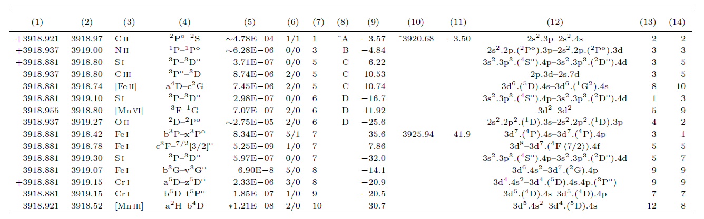

## Introduction

PyEMILI is a Python-based automatic line identification tool designed for analyzing weak lines in high-resolution spectra. It builds upon the foundation of EMILI, the first-generation line identification program developed by [B. Sharpee et al. (2003)](https://ui.adsabs.harvard.edu/abs/2003ApJS..149..157S/abstract). PyEMILI incorporates many updates and corrections to improve upon the original EMILI, addressing various details to enhance its accuracy and performance for modern spectral analysis.

PyEMILI is currently equipped to handle spectral data within the wavelength range of 1000–20000 Å, utilizing the comprehensive [Atomic Line List v3.00b4](https://www.pa.uky.edu/~peter/newpage/index.html), which contains approximately 900,000 atomic transitions in this wavelength range. Additionally, PyEMILI utilizes transition probabilities sourced from the [Kurucz Line List](http://kurucz.harvard.edu/linelists.html), ensuring accurate line identifications and reliable results for the analysis of emission and absorption features.

A key enhancement in the current version of PyEMILI is the introduction of the `Spec` module. This module significantly enhances the program’s ability to automatically or manually search for a large number of spectral lines in deep spectra. By using the `Spec` module, users can efficiently analyze complex spectral data and identify emission features that might otherwise be missed in manual analysis. More information can be found in [Automatic line Searching](./Line_finding.md).

### Workflow

### Line Identification Method

PyEMILI is designed not to model spectra, but to assist in the identification of weak spectral lines by proposing multiple potential identifications (IDs) and ranking them based on a scoring system. This scoring evaluates how well each candidate line satisfies certain predefined criteria. Each spectral line identified by PyEMILI is assessed and scored based on three distinct components: **wavelength agreement (W)**, **predicted flux (F)**, and **multiplet check (M)**. The overall identification score for each putative ID is defined by the sum of these three components.

#### **1. Wavelength Agreement (W)**
The **wavelength agreement** score is based on how closely the observed line’s wavelength matches the wavelength of a potential identification after correcting for systemic velocity. The residual difference between the observed line's wavelength and the wavelength of the putative ID is expressed as a multiple of the wavelength uncertainty ($\sigma$, needed in the *Input Line List*) in the observed line's wavelength. This residual difference, denoted as $\Delta \lambda$ (in km/s), determines the **W** score according to the following conditions:

- **W = 0** if $\Delta\lambda \leq 1\sigma$
- **W = 1** if $1\sigma < \Delta\lambda \leq 2\sigma$
- **W = 2** if $2\sigma < \Delta\lambda \leq 3\sigma$
- **W = 3** if $3\sigma < \Delta\lambda \leq 4\sigma$
- **W = 4** if $4\sigma < \Delta\lambda \leq 5\sigma$

Lines with a closer match (lower $\Delta\lambda$) will receive a lower **W** score, indicating a better match.

#### **2. Predicted Flux (F)**
The **predicted flux** score is based on the expected intensity of the spectral line. For each putative ID within a $5\sigma$ wavelength difference (surviving the wavelength agreement assessment), the predicted flux ($I$) from a template is calculated. The highest predicted flux is denoted as $I_{\text{max}}$. Each ID is scored based on how its predicted flux compares to $I_{\text{max}}$, following these criteria:

- **F = 0** if $I \geq 0.1I_{\text{max}}$
- **F = 1** if $I \geq 0.01I_{\text{max}}$
- **F = 2** if $I \geq 0.001I_{\text{max}}$
- **F = 3** if $I \geq 0.0001I_{\text{max}}$
- **F = 4** if $I < 0.0001I_{\text{max}}$

Putative IDs with predicted fluxes less than $0.0001I_{\text{max}}$ are not considered further, as they are too weak to be reliable candidates. Higher fluxes lead to lower **F** scores, indicating a better match.

#### **3. Multiplet Check (M)**
The **multiplet check** evaluates whether the putative ID belongs to a multiplet and, if so, whether other members of the multiplet are also detected in the spectrum. Each putative ID’s multiplet members are examined, and both the number of observable multiplet members ($P$) and the number of detected multiplet members ($D$) are considered. The **M** score is determined according to the following conditions:

- **M = 0** if $P = 2$, and either $D = 2$ or $D > 2$
- **M = 1** if $P = 1$, $D = 1$, or $P > 2$, $D = 2$
- **M = 2** if $P = 0$, $D = 0$, or $P > 1$, $D = 1$
- **M = 3** if $P = 1$, $D = 0$, or $P = 2$, $D = 0$
- **M = 4** if $P > 2$, $D = 0$

The presence of multiple detected multiplet members improves the match, resulting in a lower **M** score.

#### **4. Identification Index (IDI)**
Finally, the **Identification Index (IDI)** is used to quantify the overall likelihood of each putative ID being the correct identification. The **IDI** is calculated as the sum of the scores from the three components:  
\[ \text{IDI} = W + F + M \]

Lower **IDI** values correspond to better matches, meaning the candidate line satisfies the criteria more closely. PyEMILI provides users with multiple potential IDs for each line, ranked by their **IDI** scores, allowing users to select the most plausible identification based on the context of their analysis.

This code is not meant to model the spectra, but rather to aid in the identification of weak lines by providing many alternative IDs with their possibilities defined by scores. For one spectral line to be identified by PyEMILI, it will be assessed and scored from three aspects with different criteria:

| W | Condition                   | F | Condition             | M   | Condition              |
|---|-----------------------------|---|-----------------------|-----|------------------------|
| 0 | $\Delta\lambda\leq 1 \sigma$          | 0 | $I\geq 0.1 I_{max}$    | 0  | $P=2,D=2$ or $D>2$     |
| 1 | $1\sigma <\Delta\lambda \leq 2\sigma$ | 1 | $I\geq 0.01 I_{max}$   | 1  | $P=1,D=1$ or $P>2,D=2$ |
| 2 | $2\sigma <\Delta\lambda \leq 3\sigma$ | 2 | $I\geq 0.001 I_{max}$  | 2  | $P=0,D=0$ or $P>1,D=1$ |
| 3 | $3\sigma <\Delta\lambda \leq 4\sigma$ | 3 | $I\geq 0.0001 I_{max}$ | 3  | $P=1,D=0$ or $P=2,D=0$ |
| 4 | $4\sigma <\Delta\lambda \leq 5\sigma$ |   |                        | 4  | $P>2,D=0$              |

**W** is the score of **wavelength agreement** component. The residual wavelength difference ($\Delta\lambda$ in km/s) between the corrected observed line's wavelength and the putative ID is within a number of standard deviations ($\sigma$) of the observed line's wavelength uncertainty.

**F** is the score of **Predicted template flux** component. For the observed line, every putative IDs within $5\sigma$ wavelength difference survived in the **wavelength agreement** part will be calculated the predicted template fluxes ($I$). The highest predicted template flux is marked as $I_{max}$. Each putative ID  will be scored by comparing with $I_{max}$. IDs with predicted template flux less than 0.0001 $I_{max}$ will not be included in the candidate lines.

**M** is the score of **Multiplet check** component. For each survived putative ID, code will search for the possibly observable multiplet members $P$ and detect the exist multiplet members $D$. The criteria are listed above.

An identification index (IDI) is used to quantify the extent of satisfaction of each putative ID with the criteria, which defines as: **IDI=W+F+M**. This is the total score of each putative ID, with **lower score being better satisfied the criteria**.

### Definition of energy bins and ionization & velocity structure models

All ions are separated into 5 bins based on the ionization energies to produce such ions. The bounds of each bin are listed below.

| bin 1   | bin 2       | bin 3       | bin 4      | bin 5  |
|---------|-------------|-------------|------------|--------|
|0-13.6 eV| 13.6-24.7 eV| 24.7-55 eV| 55-100 eV| >100 eV|

Each bin has the parameters of ionization and velocity structure models. The ionization structure model refers to the proportion of ions in a given ionization bin to the total elemental abundance of that ion. The modified abundances of ions are derived through the total abundances of the elements multiplied by the values of ionization structure model for the bins in which the ions reside. Baldwin et. al. (2000) have shown that in the rest frame of a nebula, the magnitude of the velocity difference between the observed and laboratory wavelengths is correlated with the parent ions' ionization energies. Thus, the velocity structure model aims to correct this correlation for different ions with different ionization energies.

For example, the minimum energy to produce $\mathrm{O^{2+}}$ is 35.11 eV, which also means the ionization energy of the $\mathrm{O^{1+}}$. Thus, $\mathrm{O^{2+}}$ will be classified into the bin 3. And all the [O III] collisionally excited lines and O II recombination lines, whose parent ion is $\mathrm{O^{2+}}$, will use the corresponding values of ionization and velocity structure models for bin 3 to calculate their scores.

Default ionization structure value for each bin:

| bin 1   | bin 2       | bin 3       | bin 4      | bin 5  |
|---------|-------------|-------------|------------|--------|
|0.01| 0.5| 0.4| 0.1| 0.001|

Default velocity structure value for each bin (in km/s):

| bin 1   | bin 2       | bin 3       | bin 4      | bin 5  |
|---------|-------------|-------------|------------|--------|
|0| 0| 0| 0| 0|

### Output files

After running `pyemili.Lines.Line_list.identify()`, two files end with **'.dat'** and **'.out'** will be generate in the directory. The '.out' file contains complete candidate lines of each input observed line. The following are some of the candidate lines for an observed line. The title information is

>`Number 98 	Observed line:	3918.93000 	 1.07E-03	SNR:226.4	FWHM:18.7`

which means this observed line is the 98th line of input line list. The observed wavelength is 3918.93. Flux is 1.07e-03 relative to the $H_\beta$.

>**Column A** presents the wavelength of the observed line after correcting from the model of velocity structure according to each candidate's ionization energy. The '`+`' notation ahead column A means that the velocity difference is less than $1\sigma$.  
>**Column B** lists the laboratory wavelength of each candidate. If this column begins with an asterisk '`*`', it means the wavelengths of all possibly observable multiplet members of this transition are within the input instrumental resolution. All multiplet members are combined together and the wavelength is the weighed wavelength.  
>**Columns C, D, L, M and N** give the emitting ion, transition, electron configuration, and statistical weight of the lower level and upper level, respectively.  
>**Columns E** shows the predicted template flux. Those predicted template fluxes denoted by tilde '$\sim$' are calculated using effective recombination coefficient data, while some others with asterisk '`*`' mean the corresponding candidates have no reference for transition probabilities, thus a typical small value is used to calculate, e.g., $10^4\ \mathrm{s^{-1}}$ for permitted electric dipole transitions, (2) $10\ \mathrm{s^{-1}}$ for intercombination transitions, (3) $10^{-5}\ \mathrm{s^{-1}}$ for magnetic dipole and electric quadrupole, and other transitions.  
>**Columns F** is the number of associated multiplet lines that should be observable compared with the number detected, e.g., `5/1` means 5 multiplet lines should be possibly observed in the input line list, but only 1 multiplet line has been detected by the code.  
>**columns G and H**, the IDI and ranking are given for each candidate. The wedge symbol '`^`' in front of the ranking means at least one detected multiplet member is ranked as 'A' in the corresponding observed line. In such a case, the candidate line is treated as one of the best IDs regardless of whether it is ranked as 'A'.  
>**Column I** is the velocity difference between Column A and Column B, which is used as $\Delta\lambda$ in the identification criteria of **wavelength agreement**.    
>**Columns J and K** show the associated multiplet lines that were possibly detected from the input line list and their velocity difference in wavelength. Up to three multiplet lines are displayed in the output.  
>**NOTE**: In each block for one observed line, the last candidate line has the **score 99 in column G**. It indicates that this line does not participate in the ranking. This line is the predicted strongest line within a wavelength difference range of 5-10 $\sigma$. It's just shown here to remind you another possibility if the input wavelength uncertainty is too low, or the possible line blending.

Another file with '.dat' is easy to understand.

>**First column** is the observed wavelength.  
>**Second column** is the line flux relative to $H_\beta$.  
>On the right side of the vertical bar are candidates with A ranking and candidates whose multiplet member is ranked as A in other observed line.
