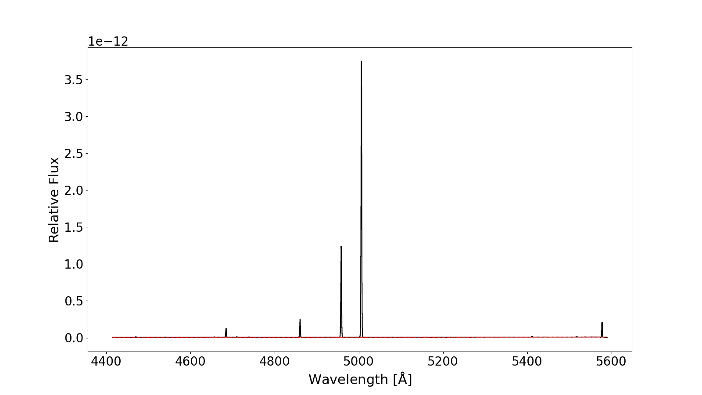

## Automatic Line Searching

The new `Spec` module allows for both automated and manual searches of spectral lines, making it easier to process deep spectra and detect even faint spectral features with high efficiency.

Key features of `Spec` module include:
- **Automatic Continuum Fitting**: PyEMILI automates the process of continuum estimation, facilitating accurate spectral line identification across a variety of datasets. The method is similar to the median filter technique. More details can be found in PyEMILI paper Section 2.7 or [(Automated Line Fitting Algorithm; Wesson 2016)](http://doi.org/10.1093/mnras/stv2946).
- **Flexible Parameter Adjustment**: Users can customize key settings such as the Signal-to-Noise (S/N) ratio threshold and peak prominence to suit the specific characteristics of their spectra.
- **Advanced Gaussian Fitting**: PyEMILI supports both single and multi-Gaussian fitting, making it ideal for handling blended lines and complex spectral profiles.
- **Interactive Matplotlib-Based Interface**: Users can inspect spectra, review detected lines, and interactively modify the results by adding or deleting lines.

`pyemili.Spec` has an integrated function called `Spec_line_finding`, can be easily used to automatically read the spectrum, fit the continuum, correct the radial velocity (optional), and find the spectral lines. Let's start with a simple example:

### example

```python
from pyemili.Spec import Spec_line_finding
Spec_line_finding('J0608_03may2019MagE.fits')
```

The input file could be a FITS file ends with `.fits`, `.fit` or `.fits.gz`, and also could be a text file that the first column is wavelength, and second is flux. if successful (if not, you can read the spectrum yourself and generate a text file), in the terminal will print:

```
Try Finding Spectrum From FITS File.
Wavelength Range: 3134.822 -- 10904.444
Press 'y' to finish or 'n' to reset the parameters:
```

along with a plot:



The black line is the spectrum, red line is the fitted continuum based on the parameters. According to the information in the terminal, if you are not satisfied with the fitted continuum, **press 'n'** can reset the parameters. Here we press `n` and press `Enter` in the terminal:

```
Enter 'percentile':
```

we reset the `percentile` parameter firstly. For the emission-line spectrum, this parameter is suggested to set as 25. We change this parameter to 75 and press `Enter`.

```
Enter 'length':
```
Now we reset the 'length' parameter, default length is 100 in the unit of x axis. In this case, the length is 100 angstroms. Here we change it to 50 and press `Enter`.

```
Press 'y' to finish or 'n' to reset the parameters:
```
 
At this time, the graph has been redrawn, continuum is refitted with input parameters. Let's see in detail what the different between these two sets of parameters.


Here is a revised version for clarity:

The top panel uses the default parameters `percentile=25` and `length=100`, while the bottom panel uses `percentile=75` and `length=50`. The fitting principle is as follows: within a specified moving window length, a chosen percentile of the flux values in that window is calculated to represent the continuum value at the midpoint of the window. Typically, in an emission-line spectrum, a `percentile` around `25` is recommended, whereas in an absorption-line-dominated spectrum, a `percentile` around `75` is more suitable. The `length` of the moving window is based on the typical full width at half-maximum (FWHM) of the spectral lines, with a wider window used for lines with larger FWHMs.

Once you finish fitting the continuum, press `y` and then `Enter`. The code then starts finding the spectral lines based on input SNR threshold. Default is 7. Another graph will show with the lines have been found.


These lines colored with red and blue are lines found by the code. The colors are interlaced to distinguish the boundaries. Take a closer view of these lines:


We could see that the 4933.440 might not be a real line and the lines around 5200 angstroms might be a line. We can put the cursor in the middle of the 4933.440 and press `d` to delete this line. Put the cursor in the left boundary of the line around 5200 angstroms and press `x` to determine the left boundary of this line, and then put the cursor in the right boundary of the line and press `x` to determine its right boundary.

After determining both boundaries of the line, code will fit the line profile by a Gaussian function. If successful, in the terminal you can see:

```
Line 4933.440 has been deleted.
x: 5192.455
x: 5205.870
Total observed flux (original): 9.281e-15
Successful line fitting.
Line center: 5198.791.Line fitted flux : 9.621e-15.
```

And the figure will be updated:


All lines manually added will be colored in orange. Once you finish modifying the line-finding results, close the figure and the terminal will print:

```
Total of 13 lines found.
```

And a file named the same as the input file, ends with `.txt` will be generated, containing the line-finding results.

### output file

```
(1)          (2)          (3)          (4)          (5)          (6)
4470.784     0.020        1.24e-14     5.59e-16     94.68        33.9        
4540.858     0.054        7.45e-15     5.65e-16     150.48       13.0        
4684.942     0.011        2.44e-13     4.43e-15     121.97       437.5       
4710.653     0.063        1.49e-14     1.52e-15     123.40       29.3        
4739.395     0.024        1.02e-14     4.77e-16     100.96       23.6        
4860.621     0.013        4.63e-13     1.08e-14     109.77       1030.4      
4921.466     0.069        4.04e-15     5.47e-16     98.78        9.0         
4958.290     0.010        2.54e-12     4.27e-14     117.44       4229.1      
5006.254     0.010        7.84e-12     1.16e-13     119.78       14692.5     
5015.205     0.045        2.96e-15     2.77e-16     89.15        7.4         
5411.154     0.023        2.76e-14     8.00e-16     137.62       36.8        
5517.445     0.074        1.27e-14     1.00e-15     169.31       14.3        
```

>**Column 1** : center wavelength  
>**Column 2** : wavelength error  
>**Column 3** : flux  
>**Column 4** : flux error  
>**Column 5** : FWHM (km/s)  
>**Column 6** : signal-to-noise ratio

### Parameters of `pyemili.Spec.Spec_line_finding`

>**filename** : str, file-like or `pathlib.Path`
>>The spectral file to be read.

>**wavelength_unit** : str
>>The unit of the wavelength. Two types are available: `nm` or `angstrom`. Default is `angstrom`.

>**ral_vel** : int, float, optional
>>The radial velocity of the spectrum in the unit of km/s. Default is 0.

>**length** : float, optional
>>The length of the moving window used to compute the continuum. A higher spectral resolution generally needs a longer moving window. Default is 100 angstroms. This Parameter is best set to 3-7 times the maximum full width of line.

>**percentile** : float, optional
>>The percentile to compute the values of continuum in a moving window. Default is 25 for pure emission line spectrum. 75 is suggested for absorption line spectrum. This parameter must be between 0 and 100.

>**check_continuum** : bool, optional
>>Whether to check the computed continuum in a plot. Default is True. If True, you will see a plot of the spectrum with the computed continuum and a command in the terminal. Follow what it says in the terminal, you can change the testing parameters.

>**save_continuum**: bool, optional
>>If True, save the plot of the spectrum with the computed continuum. Default is False.  

>**vel_cor** : bool, optional
>>If True, correct the radial velocity using the `correct_velocity` function. Default is False.  

>**snr_threshold** : float, optional
>>The minimum SNR value of the spectral line to be found. Default is 7.  

>**prominence** : float, optional
>>Required prominence of peaks. See details in `scipy.signal.peak_prominences`. The parameter input here is the multiple of the continuum uncertainty. e.g., `prominence = 2` means 2 multiplied by the continuum uncertainties. Default is 6.  

>**check_lines** : bool, optional
>>If True, an interactive plot will be presented with the spectral lines automatically found. These lines will be colored by blue or red in order to distinguish the boundaries of lines. Default is True.  

>**append** : bool, optional
>>If True, instead of overwriting the saved line list file, the line list will be added starting from the last line of the line list file.  

NOTE:

* Place the cursor on the boundary of the line and press the keyboard 'X' to determine the boundaries of the line you want to add. After pressing 'X' twice, the fluxes in covered wavelengths will be fitted by Gaussian function. And the details of this line will be add in the output line list if the fit is successful.
* Place the cursor within the wavelength of line you want to delete and press the keyboard 'D' to delete this line. Lines found automatically can also be deleted.
